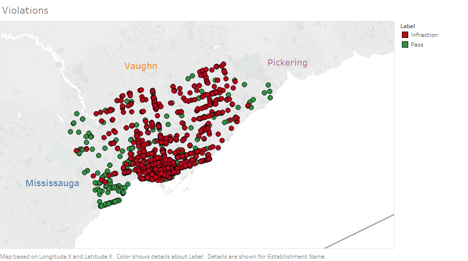

# DineSafe Infraction Predictor
Machine Learning Algorithms predict the outcomes of health inspections for businesses in Toronto.

# Abstract

  Health code violation can result in fines exceeding $1000, and can damage the image of an establishment. 
Information regarding violations are easily available to potential customers through social media and local blogs such as [blogTO](https://www.blogto.com/eat_drink/2018/09/toronto-dinesafe-tim-hortons-wing-machine-3-brewers-big-smoke-burger/). 
The DineSafe Predictive Model uses Yelp reviews, and relevant business data to predict the outcome of an establishment’s 
next inspection. Using the prediction, establishments can make the necessary adjustments to prevent infractions. Firstly, the model 
predicts whether a violation will occur for a given inspection, then an independent model predicts the type of prediction. The results
of the model are shown below.

  
  

# Introduction

The goals of the project are to firstly, predict whether a given health inspection will result in a violation, which results in a binary prediction of a violation or a pass. A health code violation has three levels of severity, 'minor,' 'significant,' and 'crucial.' An independent model was built to predict the type of violation resulting from a health inspection; this prediction could also result in a ‘pass.’ This results in a four-class prediction problem. 
‘Minor’ violations are defined as ‘Infractions that present a minimal health risk,’ by the Dine Safe website [2].  These violations are more of a common occurrence, resulting in **36 % (32464 of 90827)** of all inspections during the period from July 2016 – June 2018. The five most common type of ‘minor’ violations are as follows:
  
*	‘Operator fail to properly wash surfaces in rooms’ with **9947 violations**.
*	‘Operator fail to properly wash equipment’ with **8118 violations**.
*	‘Operator fail to properly wash equipment’ with **6713 violations**.
*	‘Operator fail to properly maintain equipment (NON-FOOD)’ with **2666 violations**.
*	‘Operator fail to provide proper equipment’ with **2141 violations**. 

A health inspector can issue a ticket of compliance, and if this violation is repeated at the next inspection, a fine ranging from $45 to $370 may be issued [2]. 
	‘Significant’ violations are the next most common, resulting in **26% (23405 of 90827)** of all inspections. ‘Significant’ violations present a potential health hazard and must be corrected within the next 24-48 hours or legal action may be taken; these violations indirectly involve food, handling, preparation, and storage [2]. The five most common type of ‘Significant’ violations are as follows:
*	‘FAIL TO PROVIDE THERMOMETER IN STORAGE COMPARTMENT O. REG  562/90 SEC. 21’ with **1478 violations**.
*	‘FAIL TO HAVE TEST REAGENT AVAILABLE AT  PLACE OF SANITIZATION O. REG  562/90 SEC. 75(2)’ with **1381 violations**.
*	‘Operator fail to use proper procedure(s) to ensure food safety’ with **1347 violations**.
*	‘Operator fail to provide adequate pest control’ with **1106 violations**.
*	‘OPERATOR FAIL TO ENSURE COVER WILL PREVENT CONTAMINATION OR ADULTERATION O. REG  562/90 SEC. 59(C)(II)’ with **1070 violations**.

‘Crucial’ violations are the rarest resulting in **2% (2236 of 90827)** of all inspections. These violations present an immediate health hazard and directly involve food. Such violations must be corrected immediately or an ‘Order to close’ can be issued [2]. The five most common type of ‘Crucial’ violations are as follows:
*	‘Operator fail to ensure food is not contaminated/adulterated’ with **778 violations**.
*	‘Operator fail to maintain hazardous food(s) at 4C (40F) or colder’ with **674 violations**.
*	‘Operator fail to maintain hazardous foods at 60C (140F) or hotter’ with **211 violations**.
*	‘Employee fail to wash hands when required’ with **217 violations**.
*	‘Operator fail to wash hands when required’ with **90 violations**.

All the statistics above are obtained from the City of Toronto, open data catalogue [3]. This data source contains information regarding the violations, and data regarding the business name and location. However, this data does not contain valuable information regarding business practices and the overall sentiment of customers regarding an establishment. To obtain relevant information regarding the business’s practices, a yelp dataset (will be referred to as the Yelp DS in this document) was combined with the health inspections dataset (will be referred to as the DineSafe DS in this document). 

# Data Engineering/Auditing

## Auditing/Cleaning the DineSafe Data Set
The DineSafe DS contains information regarding 90827 health inspections from the time period between July 2016 through June 2018. The dataset contains the following data about the establishments:
* Establishment Name.
* Establishment Address.
* Establishment Status.
* Establishment Type, which contains 54 different establishment types ranging from ‘Restaurant’ to ‘Hospitals & Health Facilities’.
* Latitude.
* Longitude.

Additionally, the dataset contains the following data regarding the inspection:
* Inspection Date.
* Minimum number of inspections per year. This could be 1,2, or 3 depending on the type of establishment, and the type of food prepared [2].
* Severity, which includes the four classes mentioned in the Introduction section.
* Action, which is dependent upon the severity.
* Amount Fined, which is a consequence of the action.
* Court Outcome, which is again dependent upon the severity and action.

The dataset contains multiple inspections regarding a given establishment caused by repeat investigations, due to requirements of compliance from a previous investigation, added to the fact that some businesses require a minimum of 2 or 3 inspections per year. The goal of the predictive model is to forecast the outcome of a given inspection, assuming that it is a new investigation, without any previous knowledge. Therefore, the data used in the predictive model meets the following criteria:

* Each establishment has a record of only one inspection.
* The inspection record used will be the most recent.
* Repeat inspections resulting from previous violations are not included in the data.

The preceding criteria was met by cleaning the data using the following steps:

* The DineSafe DS was grouped by the three years (2016,2017 & 2018).
* The grouped datasets were sorted by date.
* The duplicates were removed using ‘Establishment ID’, which is a unique key for each establishment. The earliest records were kept, this would eliminate any repeat inspections resulting from previous violations.
* Once the duplicates have been removed, the three grouped data sets were merged.
* Duplicates were removed from the merged data set, keeping the most recent inspection. This was done to have more pertinent data in the data set. 

The removing of duplicates results in a total of 16160 establishment records.

## Merging the DineSafe DS with the Yelp DS

The Yelp DS contains important information regarding business practices, and the public sentiment about the business. The Yelp DS contains data regarding the business location, by way of the longitude and latitude. The two datasets were combined as follows:

* The longitude and latitude from both datasets were compared for matches.
* A tolerance level for the matching was set, which translate to 1 m in distance [3].
* As an additional measure, the establishment names in both datasets were first cleaned (by removing any spacing and using lower case letters), and then compared for matches on the first 5 letters.

Combining the two datasets resulted in reducing the data to 5639 records, which includes data regarding business practices of 5639 businesses, as well as the outcome of their most recent inspection.

##Cleaning Combined Dataset
	The combined dataset contains data such as ‘Action’, ‘Amount Fined’, & ‘Court Outcome’, which are dependent upon the ‘Severity’ of a violation. The model aims to predict the ‘Severity’ of a violation. Including columns such as ‘Action’ and ‘Amount Fined’ would result in a data leak, therefore, these columns were removed from the dataset.
	A great deal of the features regarding Business practices were attributes such as ‘Good for Kids’ or ‘Dogs Allowed’, which results in a binary outcome. The null values for these features were set to 0. Additional features which had categorical outcomes were assigned dummy variables.
	Business opening and closing times could provide key insights into whether an inspection will result in a violation. The null values in opening and closing times for a given day were filled by the values of the opening and closing times for which data is available. To elaborate, if a business is open from Monday through Saturday, but closed on Sundays, the null values in Sunday were filled by the Monday times. If no values on opening and closing times were found, the mean time values were assigned to the null values.

