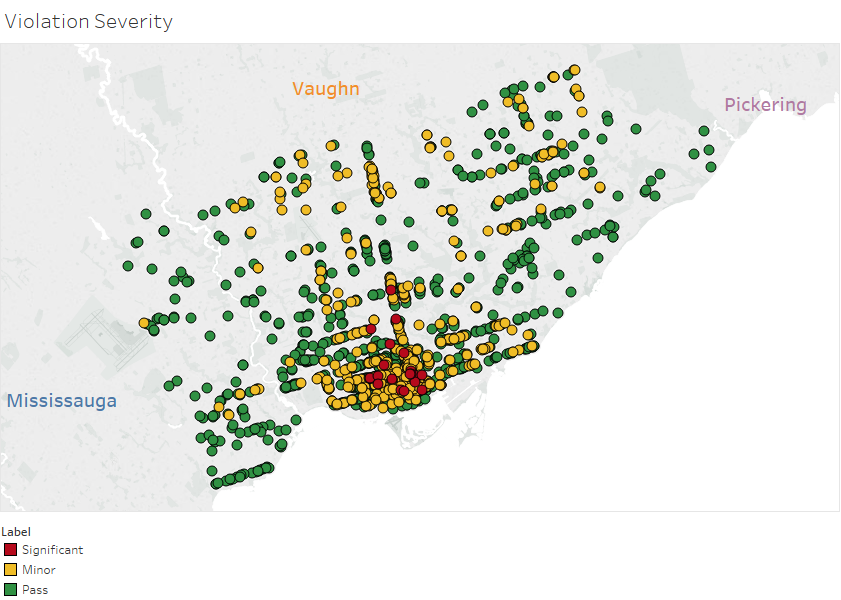

# DineSafe Infraction Predictor
Machine Learning Algorithms predict the outcomes of health inspections for businesses in Toronto.

# Abstract

  Health code violation can result in fines exceeding $1000, and can damage the image of an establishment. 
Information regarding violations are easily available to potential customers through social media and local blogs such as [blogTO](https://www.blogto.com/eat_drink/2018/09/toronto-dinesafe-tim-hortons-wing-machine-3-brewers-big-smoke-burger/). 
The DineSafe Predictive Model uses Yelp reviews, and relevant business data to predict the outcome of an establishment’s 
next inspection. Using the prediction, establishments can make the necessary adjustments to prevent infractions. Firstly, the model 
predicts whether a violation will occur for a given inspection, then an independent model predicts the type of prediction. The results
of the model are shown below.

 
 
