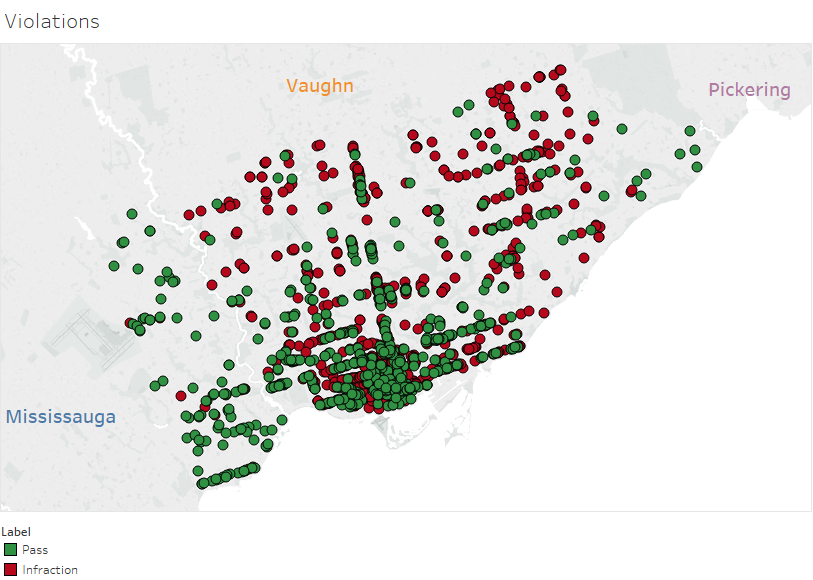

# DineSafe Infraction Predictor
Machine Learning Algorithms predict the outcomes of health inspections for businesses in Toronto.

# Abstract

  Health code violation can result in fines exceeding $1000, and can damage the image of an establishment. 
Information regarding violations are easily available to potential customers through social media and local blogs such as [blogTO](https://www.blogto.com/eat_drink/2018/09/toronto-dinesafe-tim-hortons-wing-machine-3-brewers-big-smoke-burger/). 
The DineSafe Predictive Model uses Yelp reviews, and relevant business data to predict the outcome of an establishment’s 
next inspection. Using the prediction, establishments can make the necessary adjustments to prevent infractions. Firstly, the model 
predicts whether a violation will occur for a given inspection, then an independent model predicts the type of prediction. The results
of the model are shown below.

  
  

# Introduction

The goals of the project are to firstly, predict whether a given health inspection will result in a violation, which results in a binary prediction of a violation or a pass. A health code violation has three levels of severity, 'minor,' 'significant,' and 'crucial.' An independent model was built to predict the type of violation resulting from a health inspection; this prediction could also result in a ‘pass.’ This results in a four-class prediction problem. 
‘Minor’ violations are defined as ‘Infractions that present a minimal health risk,’ by the Dine Safe website [2].  These violations are more of a common occurrence, resulting in **36 % (32464 of 90827)** of all inspections during the period from July 2016 – June 2018. The five most common type of ‘minor’ violations are as follows:
  
*	‘Operator fail to properly wash surfaces in rooms’ with **9947 violations**.
*	‘Operator fail to properly wash equipment’ with **8118 violations**.
*	‘Operator fail to properly wash equipment’ with **6713 violations**.
*	‘Operator fail to properly maintain equipment (NON-FOOD)’ with **2666 violations**.
*	‘Operator fail to provide proper equipment’ with **2141 violations**. 

A health inspector can issue a ticket of compliance, and if this violation is repeated at the next inspection, a fine ranging from $45 to $370 may be issued [2]. 
	‘Significant’ violations are the next most common, resulting in **26% (23405 of 90827)** of all inspections. ‘Significant’ violations present a potential health hazard and must be corrected within the next 24-48 hours or legal action may be taken; these violations indirectly involve food, handling, preparation, and storage [2]. The five most common type of ‘Significant’ violations are as follows:
*	‘FAIL TO PROVIDE THERMOMETER IN STORAGE COMPARTMENT O. REG  562/90 SEC. 21’ with **1478 violations**.
*	‘FAIL TO HAVE TEST REAGENT AVAILABLE AT  PLACE OF SANITIZATION O. REG  562/90 SEC. 75(2)’ with **1381 violations**.
*	‘Operator fail to use proper procedure(s) to ensure food safety’ with **1347 violations**.
*	‘Operator fail to provide adequate pest control’ with **1106 violations**.
*	‘OPERATOR FAIL TO ENSURE COVER WILL PREVENT CONTAMINATION OR ADULTERATION O. REG  562/90 SEC. 59(C)(II)’ with **1070 violations**.

‘Crucial’ violations are the rarest resulting in **2% (2236 of 90827)** of all inspections. These violations present an immediate health hazard and directly involve food. Such violations must be corrected immediately or an ‘Order to close’ can be issued [2]. The five most common type of ‘Crucial’ violations are as follows:
*	‘Operator fail to ensure food is not contaminated/adulterated’ with **778 violations**.
*	‘Operator fail to maintain hazardous food(s) at 4C (40F) or colder’ with **674 violations**.
*	‘Operator fail to maintain hazardous foods at 60C (140F) or hotter’ with **211 violations**.
*	‘Employee fail to wash hands when required’ with **217 violations**.
*	‘Operator fail to wash hands when required’ with **90 violations**.

All the statistics above are obtained from the City of Toronto, open data catalogue [3]. This data source contains information regarding the violations, and data regarding the business name and location. However, this data does not contain valuable information regarding business practices and the overall sentiment of customers regarding an establishment. To obtain relevant information regarding the business’s practices, a yelp dataset (will be referred to as the Yelp DS in this document) was combined with the health inspections dataset (will be referred to as the DineSafe DS in this document). 
